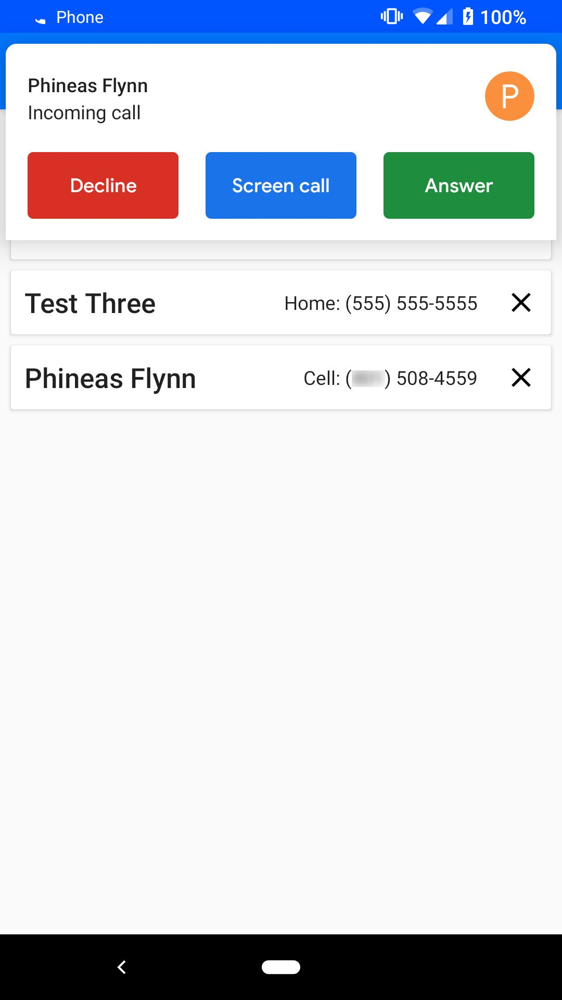
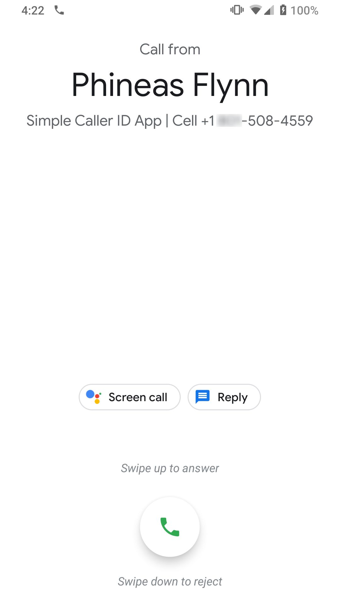

# Simple Caller ID App
Here at SimpleNexus, we sell software to mortgage companies.
These companies can have hundreds of loan officers, and thousands of users.
Company admins and especially loan officers wanted a way to differentiate between their app users and spam calls.
A recent deploy to our app displays app user data as caller ID.
Now when admins and loan officers receive phone calls from users not saved in their phone they can confidently answer.
This caller ID functionality has many more practical applications.

# Purpose

This article teaches how to display your users as caller ID data.
Developing this in the SimpleNexus app was extremely difficult because of lack of documentation.
The most helpful documentation found on this subject was in the Android docs regarding [ContactsContract.Directory](https://developer.android.com/reference/android/provider/ContactsContract.Directory) and [ContactsContract.PhoneLookup](https://developer.android.com/reference/android/provider/ContactsContract.PhoneLookup.html).
But who doesn't like some real life code examples to learn from?

# Get Started

Clone or fork the [Sample Caller ID App](https://github.com/SimpleNexus/simplecallerid) repository.
The `master` branch is the starting point for this tutorial.
The `callerid` branch is the final product of this tutorial.

Get a phone or Google Voice account with a phone number <b>not</b> in your contacts app.

You may need to disable spam filtering on your Android device.

# Content Providers

One of the key native elements in Android development is the ContentProvider.
We will need to create one to send information to apps that want phone numbers:
```
class CallerIDProvider : ContentProvider() {
  private val uriMatcher = UriMatcher(UriMatcher.NO_MATCH)
  override fun onCreate(): Boolean {
    context?.let {
      val authority = it.getString(R.string.callerid_authority)
      uriMatcher.addURI(authority, "directories", DIRECTORIES)
    }
    return true
  }
  override fun query(uri: Uri, projection: Array<out String>?, selection: String?, selectionArgs: Array<out String>?, sortOrder: String?): Cursor? {
    when (uriMatcher.match(uri)) {
        DIRECTORIES -> { /* TODO */ }
    }
    return null
  }

  override fun getType(uri: Uri): String? {
    return null
  }

  override fun delete(uri: Uri, selection: String?, selectionArgs: Array<String>?): Int {
    throw UnsupportedOperationException()
  }

  override fun insert(uri: Uri, values: ContentValues?): Uri? {
    throw UnsupportedOperationException()
  }

  override fun update(uri: Uri, values: ContentValues?, selection: String?, selectionArgs: Array<String>?): Int {
    throw UnsupportedOperationException()
  }

  companion object {
    private const val DIRECTORIES = 1
  }
}
```
In the Android Manifest:
```
<provider
    android:name=".callerid.CallerIDProvider"
    android:authorities="@string/callerid_authority"
    android:readPermission="android.permission.READ_CONTACTS"
    android:enabled="true"
    android:exported="true">
    <meta-data
      android:name="android.content.ContactDirectory"
      android:value="true"/>
</provider>
```
If you're like me, you've never seen some of this stuff before.
So let me explain what is happening here.
The key elements to this content provider are:

- The `query` method: All ContentProviders need a query method. Any service asking for information from an app will send a URI matching what kind of data they want, and a projection reference of which columns it wants. The result is a cursor with the data requested.
- The `uriMatcher`: As mentioned in the documentation linked above regarding ContactContract.Directory, to display "directory" information (such as phone numbers and email addresses), the app must first display directory account information. This has to be unique from all other apps on the device. More will be explained later on what to return in response to the "directories" uri.
- The `<meta-data>`: This is how the system know that your app can provide directory information. Much like an intent. Important also to notice, the provider has "authorities". It is important to use the same authority throughout your content provider, but the value is not as important. For this app my authority was `com.example.simplecallerid.callerid`.

# Directories

The first step is to display directory account information.
These values can be arbitrary, they just need to be unique.
In the `query` method, fill a MatrixCursor with the right column data and send it back:
```
DIRECTORIES -> {
    val label = context?.getString(R.string.app_name) ?: return null
    val cursor = MatrixCursor(projection)
    projection?.map { column ->
      when (column) {
        Directory.ACCOUNT_NAME,
        Directory.ACCOUNT_TYPE,
        Directory.DISPLAY_NAME -> label
        Directory.TYPE_RESOURCE_ID -> R.string.app_name
        Directory.EXPORT_SUPPORT -> Directory.EXPORT_SUPPORT_SAME_ACCOUNT_ONLY
        Directory.SHORTCUT_SUPPORT -> Directory.SHORTCUT_SUPPORT_NONE
        else -> null
      }
    }?.let { cursor.addRow(it) }
    return cursor
}
```
Now the system knows your app can provide a few kinds of data.
It will send URI's like `contacts/lookup/*`, `phone_lookup/*`, `data/emails/lookup/*` etc.

# Phone Lookup: Caller ID

The important URI for a caller ID app is `phone_lookup/*`.
Add the following to your ContentProvider:
```
// In the onCreate
uriMatcher.addURI(authority, "phone_lookup/*", PHONE_LOOKUP)

// In the query when block
PHONE_LOOKUP -> { /* TODO */ }

// In the companion object
private const val PHONE_LOOKUP = 2
```
Let's get the data:
```
// In the UserDao
@Query("SELECT * FROM user_table")
suspend fun getUsersList(): List<User>

// In the UserRpository
suspend fun getUser(phoneNumber: String) = withContext(Dispatchers.Default) {
  val users = userDao.getUsersList()
  users.firstOrNull { it.hasPhone(phoneNumber) }
}

// In the CallerIDProvider
private var userRepository: UserRepository? = null

// In the onCreate context let block
val userDao = UserDatabase.getDatabase(it).userDao()
userRepository = UserRepository(userDao)
```
Now all that's left to do is return a cursor with your contact data:
```
PHONE_LOOKUP -> {
  userRepository?.let { userRepo ->
    val phoneNumber = uri.pathSegments[1]
    val cursor = MatrixCursor(projection)
    val user = runBlocking(Dispatchers.IO) { userRepo.getUser(phoneNumber) }
    user?.let { u ->
      projection?.map { column ->
        when (column) {
          PhoneLookup._ID -> -1
          PhoneLookup.DISPLAY_NAME -> u.fullName
          PhoneLookup.LABEL -> u.phoneLabel
          else -> null
        }
      }?.let { cursor.addRow(it) }
    }
    return cursor
  }
}
```
You should now be able to run your app on your phone.
Add a user with a phone number you don't have saved to a contact on your phone.
Call yourself from that phone number and you should see something like this:
<p float="left">
  
  
</p>

Play around with it, have fun, and think of more ways this can be used.

### Credit:
- Android Codelabs - Room with a View: https://codelabs.developers.google.com/codelabs/android-room-with-a-view-kotlin/
- https://developer.android.com/reference/android/provider/ContactsContract.Directory
- https://developer.android.com/reference/android/provider/ContactsContract.PhoneLookup
